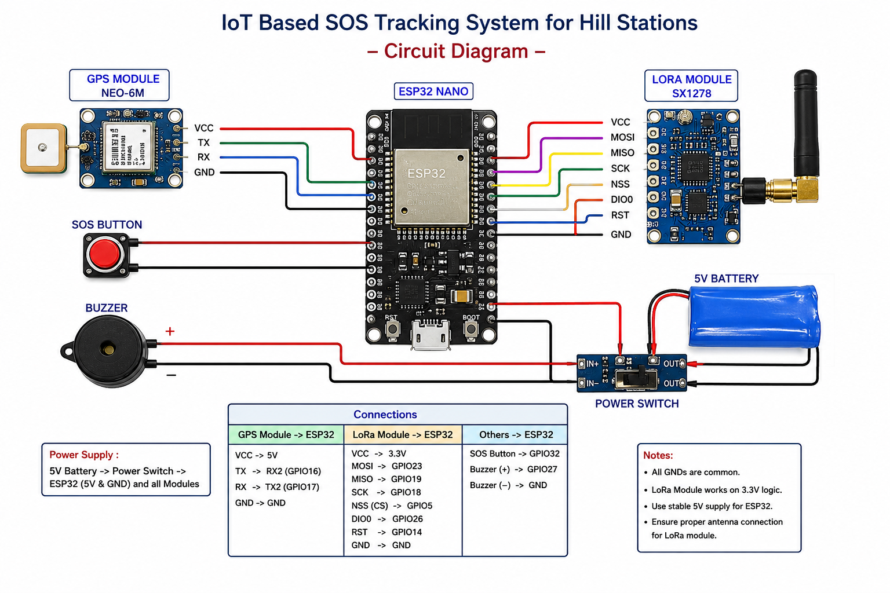

# 🚨 Tracking SOS IoT Device

An **Intelligent Emergency Alert and Wireless Tracking System** that provides **real-time GPS location tracking** and **SOS emergency alerts** using IoT technologies. The system is designed for use in remote and critical areas where reliable communication is essential.

---

## 📌 Overview

The Tracking SOS IoT Device is designed to improve personal safety by continuously monitoring the user's location and transmitting emergency alerts when required.

The system combines **GPS**, **LoRa/GSM communication**, and an embedded controller to provide reliable tracking even in areas with limited network connectivity.

---

## ✨ Features

- 📍 Real-time GPS location tracking
- 🚨 One-click SOS emergency alert
- 📡 Long-range wireless communication (LoRa)
- 📱 SMS/Data based emergency notification
- 🔋 Battery-powered portable device
- 📌 Google Maps location sharing
- 🔔 Emergency buzzer and LED indication
- ⚡ Low power operation

---

# Problem Statement

Many remote and rural areas suffer from poor mobile network connectivity, making it difficult to communicate during emergencies.

Existing emergency systems generally depend on cellular or internet connectivity, which may not be available in critical situations.

This project aims to provide a reliable emergency tracking solution using wireless communication technologies.

---

# Objectives

- Provide real-time location tracking
- Send emergency SOS alerts instantly
- Improve safety in remote areas
- Reduce response time during emergencies
- Support future integration with advanced IoT technologies

---

# Applications

- Women Safety
- Child Tracking
- Elderly Monitoring
- Tourist Safety
- Adventure & Trekking
- Industrial Worker Safety
- Search & Rescue Operations
- Smart City Applications

---

# Hardware Components

| Component | Description |
|-----------|-------------|
| ESP32 / Arduino | Main Controller |
| GPS Module (NEO-6M / NEO-M8N) | Location Tracking |
| LoRa SX1278 | Long Range Communication |
| GSM Module (Optional) | SMS Alert |
| SOS Push Button | Emergency Trigger |
| Li-ion Battery | Power Supply |
| Voltage Regulator | Stable Power |
| Buzzer | Alert Indicator |
| LED | Status Indicator |

---

# Software Stack

- Arduino IDE
- Embedded C / C++
- GPS Data Parsing
- LoRa Communication
- Google Maps
- Firebase / ThingsBoard (Optional)
- AWS IoT (Future Scope)

---

# Working Principle

1. Device powers ON.
2. GPS module acquires live location.
3. Controller reads GPS coordinates.
4. Location is periodically transmitted.
5. User presses SOS button during emergency.
6. Emergency alert is generated.
7. Current GPS location is transmitted.
8. Authorized person receives Google Maps link.
9. Rescue team can track the live location.

---

# Block Diagram

<p align="center">

</p>

---

# Circuit Diagram

<p align="center">

</p>

---

# Hardware

<p align="center">

</p>

---

# Project Images

<p align="center">

</p>

---

# Methodology

- System Initialization
- GPS Location Acquisition
- Data Processing
- Normal Monitoring Mode
- SOS Detection
- Alert Transmission
- Live Location Tracking
- Power Management

---

# Future Scope

- Heart Rate Monitoring
- Fall Detection
- Temperature Monitoring
- Cloud Dashboard
- Mobile Application
- AI-based Emergency Detection
- Satellite Communication Support

---

# Research Papers Referred

1. LPWAN-Based Emergency Response System (Sensors, 2024)
2. Global Emergency System using WPAN & LPWAN
3. IoT Tracking using LoRa
4. GPS & LoRa Child Safety System
5. IoT Vehicle Monitoring over LoRa
6. GNSS Based Road Safety System
7. Smart Shield IoT Emergency Device
8. Lifeline Emergency Ad-hoc Network
9. IoT & Wireless Sensor Networks in Disaster Management
10. Location Enabled IoT (LE-IoT)

---

# Repository Structure

```
Tracking-SOS-IoT-Device
│
├── README.md
├── screenshots
│   ├── block_diagram.png
│   ├── circuit_diagram.png
│   ├── hardware_img.jpeg
│   └── Screenshot1.png
│
├── Arduino_Code
├── Documentation
└── Hardware
```

---

# Team Members

- **Mrunali Jibhakate**
- **Palak Nikhare**
- **Sakshi Raut**
- **Gauri Sitre**
- **Karan Nehare**

---

# Guide

**Prof. Rupali Balpande**

Department of Electronics Engineering

Yeshwantrao Chavan College of Engineering, Nagpur

---

# License

This project is developed for educational and academic purposes.

